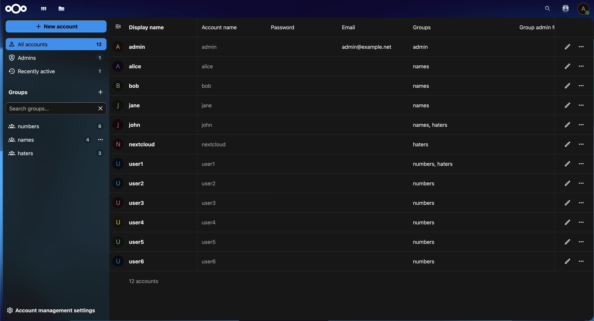

# Nextcloud SCIM Connector

SCIM connector for Nextcloud

This is essentially a translator from SCIM to Nextcloud's user and group provisioning APIs. This project aims to add SCIM service provider (the application-end) functionality to Nextcloud, as the existing Nextcloud [scimserviceprovider project](https://forge.libre.sh/libre.sh/scimserviceprovider) has had very little development recently, and I'm tired of waiting.

I aim to make this implementation as complete as is reasonably possible for a full-time student (me) to implement in their free time, but I am sure I have left some things out. It is specifically optimized for Authentik and user_oidc, as that is my intended deployment, but it will likely work with other IdP's and SSO protocols and implementations.

Some things are deliberately left unimplemented, as I do not have the capacity at this time to implement them well. See the next three sections for details on what this does and does not implement, and what I plan on implementing in the future.

> [!NOTE]
> This connector currently provisions users into the default built-in user database, not ones specific to user_oidc and the like. If user_oidc is configured correctly though, it can still take over authentication of these users. I may consider reworking this to target the user_oidc endpoints instead in the future.

## What's missing or not implemented

- PATCH operations on users — see note under To-Do's
- the /Me endpoint
- Sorting
- ETags
- Bulk operations
- Password changing &mdash; this will never be implemented, as you should probably rely on an external authentication provider when using SCIM.
- Filter

## What *is* implemented

Generally speaking, everything not listed above *should* be implemented, but there are a few things that should be explicitly pointed out to ensure clarity:

- PATCH operations on groups — required for updating group membership
- GET /ServiceProviderConfig — ensures the identity provider knows what this does and doesn't support, like filter operations.

## To-Do

- [x] Add user to group
- [x] Remove user from group
- [ ] Update user attribute — [PATCH /Users](https://scim.dev/playground/users.html#update-attribute)
    - Currently not implemented, as SSO authenticatino (OIDC, SAML, etc.) can do this, and implementing the field translation may require another major refactoring.
- [ ] Handle multiple patch operations at once
    - [ ] PATCH /Users
    - [ ] PATCH /Groups
- [ ] HTTP Bearer authentication — [potentially helpful StackOverflow thread](https://stackoverflow.com/questions/76867554/fastapi-how-to-access-bearer-token)
- [ ] Target the right user backend (oidc_user, etc.) instead of the default built-in one
    - Will require a modified API wrapper for those specific endpoints
- [ ] Testing!! — in progress
    - [ ] pytest
        - [x] Receiver
        - [ ] NCUser to/from ScimUser conversion
        - [ ] NCApi calls, both UserAPI and GroupAPI
    - [x] Nextcloud test environment — uses a customized container based on [ghcr.io/juliusknorr/nextcloud-dev-php81](ghcr.io/juliusknorr/nextcloud-dev-php81:latest)
        - Will need to target a specific version of Nextcloud for testing with oidc_user, as it doesn't support untagged versions (i.e. pulling directly from the Git repo's main/master branch)
    - [x] GitHub Action

## Development

**System dependencies for development:**

- Python 3.13+
- Poetry
- `xq` - [github.com/sibprogrammer/xq](https://github.com/sibprogrammer/xq)
- Docker and Docker Compose
- `act` - [github.com/nektos/act](https://github.com/nektos/act)

[nektos/act](https://github.com/nektos/act) is required for automated unit tests. It runs the GitHub Actions locally, which spin up and provision an isolated and consistent test environment.

These are the expected groups. They are configured automatically by [tests/prep-users-and-groups.sh](./tests/prep-users-and-groups.sh) using offical APIs.
Also, the [command-line tool `xq`](https://github.com/sibprogrammer/xq) is used in the prep-users-and-groups.sh script to parse the XML.

- Nextcloud user API: https://docs.nextcloud.com/server/latest/admin_manual/configuration_user/instruction_set_for_users.html
- Nextcloud group API: https://docs.nextcloud.com/server/latest/admin_manual/configuration_user/instruction_set_for_groups.html#create-a-group

> [!IMPORTANT]
> Ruff and isort are used for linting and formatting. Please use them before submitting any code. Code that does not conform to the formatting rules configured in the pyproject.toml file will not be accepted.
